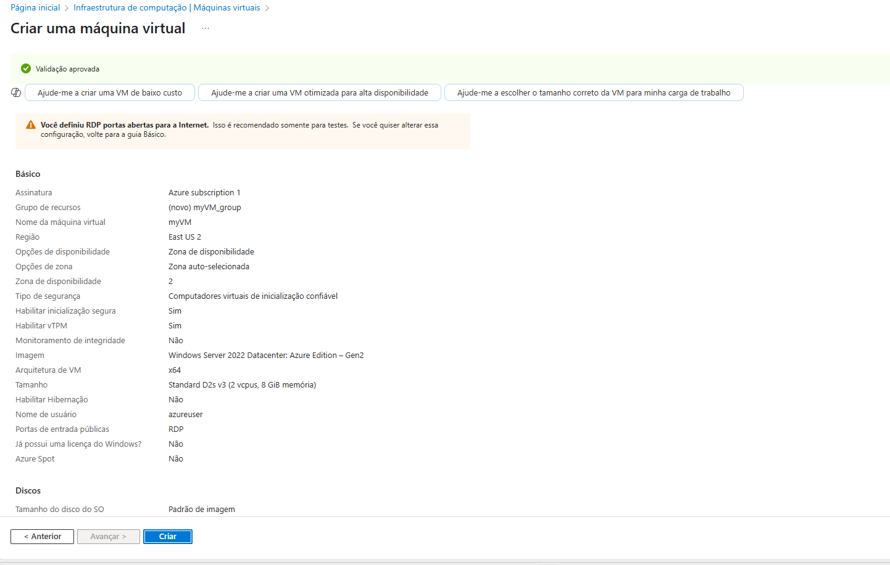
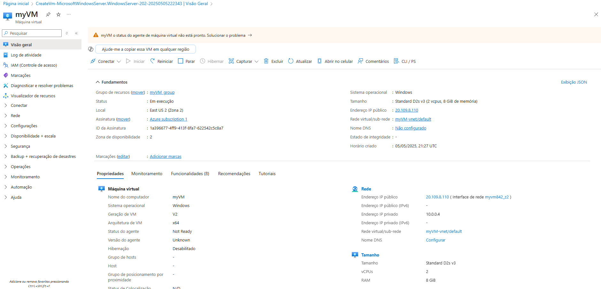
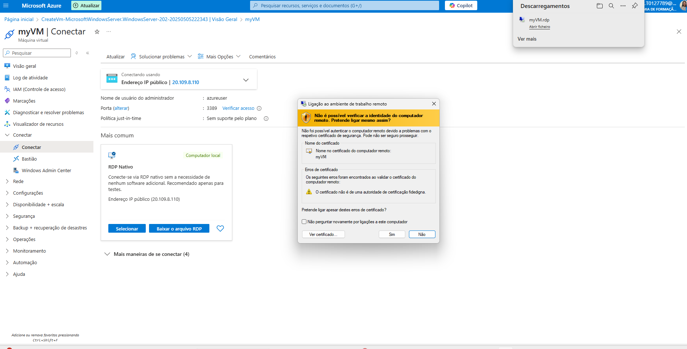

# Computação na Nuvem: Conceitos e Modelos

## Introdução

A **computação em nuvem** (cloud computing) é o fornecimento de serviços de computação pela internet, permitindo inovações rápidas e recursos flexíveis. Na prática, a nuvem é um data center virtualizado, ou seja, um centro de processamento de dados acessado pela web, que pode ser utilizado para armazenar dados, rodar aplicativos e muito mais.

## Modelos de Nuvem

A computação em nuvem pode ser dividida em quatro modelos principais:

### 1. Nuvem Privada
Na **nuvem privada**, as organizações são responsáveis pela segurança, manutenção e infraestrutura. Os dados de acesso são restritos e não são fornecidos para utilizadores fora da organização. A infraestrutura de TI é exclusiva para a organização.

- **Responsabilidade:** Organização
- **Segurança:** Controlada internamente
- **Acesso:** Restrito à organização

### 2. Nuvem Pública
A **nuvem pública** é fornecida por empresas que oferecem serviços para múltiplos clientes. As empresas pagam apenas pelo que utilizam, o que proporciona flexibilidade. As aplicações podem ser rapidamente provisionadas e desprovisionadas, e recursos e serviços podem ser compartilhados entre diversas organizações e utilizadores.

- **Responsabilidade:** Provedor de nuvem
- **Segurança:** Controlada pelo provedor
- **Acesso:** Público para múltiplos usuários

### 3. Nuvem Híbrida
A **nuvem híbrida** combina as vantagens das nuvens privada e pública. As organizações podem escolher onde executar seus aplicativos, seja na nuvem privada ou pública, dependendo das necessidades. Isso oferece uma flexibilidade maior e a capacidade de distribuir cargas de trabalho de maneira eficiente.

- **Responsabilidade:** Dividida entre organização e provedor
- **Segurança:** Dependente do modelo
- **Acesso:** Flexível, com combinações de nuvem privada e pública

### 4. Multicloud
A **multicloud** refere-se ao uso de vários provedores de nuvem públicos ou privados ao mesmo tempo, permitindo que a organização maximize os benefícios de diferentes plataformas. Isso pode ser útil para evitar dependência de um único provedor e melhorar a resiliência.

- **Responsabilidade:** Dividida entre vários provedores
- **Segurança:** Variável, dependendo dos provedores
- **Acesso:** Múltiplas plataformas de nuvem

## Conceitos Financeiros

### CapEx (Capital Expenditure)
**CapEx** são as despesas de capital, ou seja, os gastos com infraestrutura, como compra de hardware e investimentos em instalações físicas. Esse tipo de gasto ocorre antes de se obter o uso real dos recursos.

### OpEx (Operational Expenditure)
**OpEx** refere-se aos pagamentos conforme o uso de produtos e serviços. Ou seja, você paga pela utilização de recursos como serviços de nuvem de acordo com o quanto os utiliza. Em modelos baseados em consumo, a cobrança é realizada conforme o uso real de recursos.

## Resumo

A computação na nuvem permite flexibilidade e inovação rápida, com diferentes modelos que atendem a diferentes necessidades de empresas. A escolha entre **CapEx** e **OpEx** é essencial para determinar como os custos serão gerenciados em relação ao consumo de recursos.

**Modelos de Nuvem:**
- Privada
- Pública
- Híbrida
- Multicloud

**Termos Financeiros:**
- **CapEx**: Despesas de capital (compra de infraestrutura)
- **OpEx**: Despesas operacionais (pagamento conforme o uso)

## Conclusão

Entender os modelos de nuvem e como os custos são gerenciados (CapEx vs OpEx) é essencial para tomar decisões informadas sobre qual solução de computação em nuvem escolher, dependendo das necessidades da sua organização ou projeto.

## Benefícios da Computação em Nuvem

A computação em nuvem não é só uma buzzword bonita — ela vem cheia de vantagens que fazem a diferença no dia a dia das empresas e profissionais de TI. Aqui vão os principais benefícios que vimos na aula:

### 🔄 Alta Disponibilidade
- Está diretamente ligada ao **SLA (Service Level Agreement)**, garantindo que os recursos estejam disponíveis praticamente o tempo todo.
- Significa menos dor de cabeça com sistemas fora do ar.

### 📈 Escalabilidade
- A capacidade de **aumentar ou diminuir recursos** conforme a necessidade.
- Se a demanda subir, você sobe junto. Se cair, você economiza.

### 📊 Elasticidade
- Vai além da escalabilidade: aqui, os recursos se **ajustam automaticamente** em tempo real de acordo com os picos de demanda.
- Ideal para lidar com eventos inesperados sem travar o sistema.

### 🔒 Confiabilidade
- Relacionada à **resiliência**. A nuvem permite distribuir os recursos em várias regiões do mundo, o que aumenta a tolerância a falhas.
- Se um servidor cair em uma região, outro assume o trabalho sem você nem perceber.

### 🧠 Previsibilidade
- Permite **avançar com confiança e segurança**, já que os recursos são planejáveis e estáveis.
- Menos surpresas desagradáveis e mais controle.

### 🛡️ Segurança (responsabilidade do cliente!)
- Apesar de o provedor oferecer ferramentas, é o **cliente quem precisa configurar e implementar as proteções** corretamente.
- Isso inclui firewalls, autenticação, criptografia, e boas práticas em geral.

---

## Criação de Máquina Virtual (Azure)

Aprendemos na aula como criar uma máquina virtual no portal do Azure utilizando o seguinte tutorial oficial da Microsoft:

🔗 [Tutorial: Criar rapidamente uma VM com Windows no Azure Portal](https://learn.microsoft.com/pt-br/azure/virtual-machines/windows/quick-create-portal)

> ⚙️ **Importante**: Para criar a máquina virtual, você precisa ter uma conta no Azure. A Microsoft oferece um plano gratuito para testes.

### 🖼️ Prints do Processo (adicione aqui)

1. Configurações básicas da VM 
   

2. Dados VM 
   

3. Acesso a VM  
   

---

## Tipos de Serviço na Nuvem

Quando falamos em computação na nuvem, não é só sobre onde os dados ficam — é também sobre **quem cuida do quê**. Existem três principais modelos de serviço na nuvem:

### 🏗️ IaaS — Infrastructure as a Service (Infraestrutura como Serviço)

- O cliente tem **mais responsabilidade e controle** sobre os recursos.
- Você gerencia o sistema operacional, armazenamento, rede, etc.
- **Alta capacidade de personalização**, ideal para quem quer montar o ambiente do seu jeito, desde o zero.
- Exemplo: Criar uma máquina virtual no Azure, AWS ou Google Cloud e configurar tudo manualmente.

🛠️ **Responsável por:** SO, apps, dados, runtime, middleware  
🛡️ **O provedor cuida de:** virtualização, servidores, armazenamento físico, rede

---

### 🧰 PaaS — Platform as a Service (Plataforma como Serviço)

- Foco total no **desenvolvimento de aplicativos**.
- O provedor oferece um ambiente já preparado, sem você se preocupar com servidores, atualizações ou sistema operacional.
- Ideal pra devs que só querem codar e lançar a aplicação rápido.

💻 **Você gerencia:** somente os apps e dados  
🔧 **O provedor cuida de:** infraestrutura, SO, runtime, banco, atualizações

---

### ☁️ SaaS — Software as a Service (Software como Serviço)

- Modelo mais simples pro usuário final.
- Tudo pronto, sem necessidade de instalação ou manutenção.
- Pagamento por uso ou modelo de assinatura (mensal/anual).
- Exemplo: Gmail, Microsoft 365, Google Drive, Zoom.

📦 **Você só usa.** O provedor cuida de tudo: software, infraestrutura, segurança, atualizações.  
🪑 Só sentar e usar!

---

| Tipo     | Gestão do Cliente | Personalização | Exemplo                       |
|----------|-------------------|----------------|-------------------------------|
| **IaaS** | Alta              | Alta           | VM no Azure, AWS EC2          |
| **PaaS** | Média             | Média          | Azure App Service, Heroku     |
| **SaaS** | Baixa             | Baixa          | Gmail, Microsoft 365, Zoom    |

---

## Componentes Arquitetônicos do Azure

Na aula de hoje, mergulhamos na estrutura por trás da mágica da Microsoft: o **Microsoft Azure**. Entender os componentes arquitetônicos é essencial pra dominar como a nuvem funciona na prática. Bora destrinchar isso:

### 🌍 Regiões

- Podemos criar recursos do Azure **em qualquer lugar do mundo**, escolhendo a região mais próxima do cliente.
- **Regiões** são compostas por **um ou mais datacenters** interconectados.
- Oferecem **baixa latência**, **alta disponibilidade**, **flexibilidade** e **escalabilidade**.
- As regiões ajudam a **preservar a residência dos dados**, o que é crucial pra atender leis locais (como a LGPD no Brasil).
- Para cada região principal, existe uma **região pareada**, usada para **replicação automática** e **recuperação de desastres** para alguns serviços.

### 🏰 Regiões Soberanas

São regiões especiais com regras diferenciadas, criadas para atender restrições governamentais ou de segurança:

- **EUA Gov (US Government)** – uso militar e governamental dos Estados Unidos.
- **China** – operada pela empresa **21Vianet**, independente da rede global da Microsoft.

### 🔧 Recursos Comuns no Azure

O Azure oferece vários recursos que você pode criar e gerenciar com facilidade. Alguns dos mais usados são:

- **Máquinas Virtuais (VMs)** – servidores prontos pra rodar apps, sistemas e serviços.
- **Armazenamento** – blob, arquivos, discos... tudo pra guardar dados com segurança.
- **Redes Virtuais (VNets)** – sua rede privada na nuvem.
- **Banco de Dados SQL (Azure SQL Database)** – banco gerenciado pra apps que precisam de persistência de dados.

---

## 🔐 Assinaturas e Contas

Organização é tudo, e no Azure isso começa pela conta e suas assinaturas:

- Uma **conta do Azure** pode conter **várias assinaturas**.
- Cada **assinatura** representa uma **unidade de cobrança, gestão e acesso**.
- Uma assinatura está **vinculada a uma única conta**, mas uma conta pode ter várias assinaturas para separar ambientes ou projetos.

### Tipos de Assinatura

1. **Desenvolvimento** – ideal pra testar coisas sem se preocupar com custos altos.
2. **Teste** – ambiente de pré-produção, onde tudo funciona como em produção, mas sem impactar o cliente.
3. **Produção** – onde o jogo é pra valer. Tudo em pleno funcionamento e voltado pro usuário final.

---

